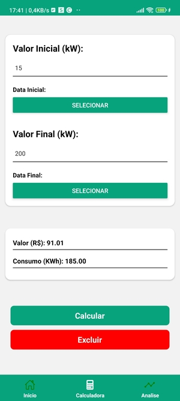
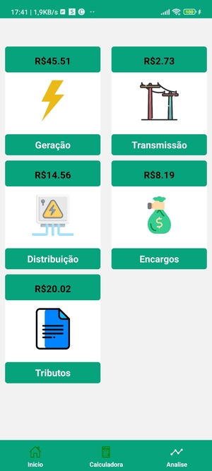

# 3nergize: Aplicativo de Cálculo de Consumo de Energia

Este projeto foi desenvolvido por mim e minha equipe da faculdade para a disciplina de Programação para Dispositivos Móveis. O 3nergize é um aplicativo que permite calcular despesas diárias, semanais e mensais para o consumo de kWh em um período específico. Não é apenas um aplicativo que mede os custos de energia; ele também fornece informações sobre como esses custos são distribuídos, desde a geração de energia até os impostos aplicáveis.

Link para o aplicativo: [3nergize](https://expo.dev/artifacts/eas/wnnJbjmwXrwpJQcLis9pes.apk)

## Tecnologias utilizadas:

- Front-end: React Native, JavaScript
- Back-end: Node.js

## Instalação:

1. Clone este repositório: `https://github.com/LucasPS0/3nergize_ReactNative.git`
2. Instale as dependências: `npm install`
3. Execute a aplicação: `npm start`

## Funcionalidades:

## Imagens: 

| .jpg) |  |  |
|---|---|---|

O aplicativo 3nergizer realiza as seguintes tarefas:

- Permite ao usuário inserir o consumo de energia em kWh e o período de tempo.
- Calcula os custos de energia com base no consumo e no período selecionado.
- Exibe informações detalhadas sobre como os custos são distribuídos, incluindo geração de energia e impostos aplicáveis.
- Oferece uma interface amigável e responsiva.

## Contribuições:

Sinta-se à vontade para contribuir com este projeto, enviando pull requests ou abrindo issues com sugestões de melhorias e correções.
